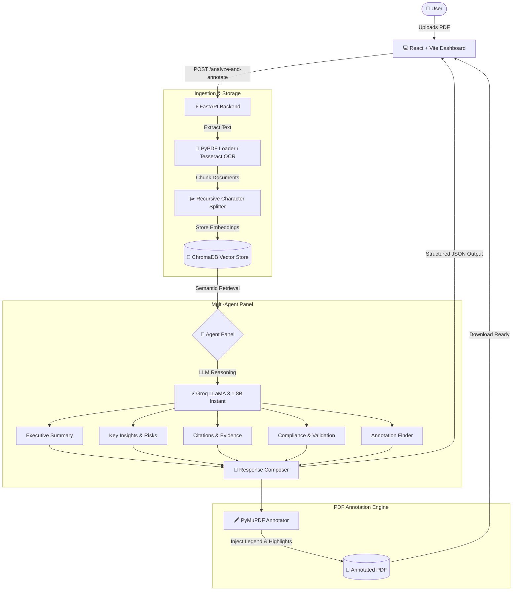

# 📄 DocIntel AI

<p align="center">
  <strong>Multi-Agent Document Intelligence & Automated PDF Annotation Platform</strong>
</p>

<p align="center">
  
  
  
  
  
  
  
</p>

---

## 🌟 Overview

**DocIntel AI** is a state-of-the-art document intelligence system that transforms dense, unstructured PDF documents (business proposals, detailed project reports, legal agreements, compliance audits, and technical specifications) into structured, actionable intelligence.

Powered by a **collaborative multi-agent LLM framework** via **Groq (LLaMA 3.1)** and semantic vector retrieval with **ChromaDB**, DocIntel AI doesn't just summarize documents—it validates compliance, flags critical risks, extracts supporting citations, and **directly annotates and highlights the original PDF** with color-coded overlays and legend boxes for downstream review.

---

## ⚡ Key Features

- **🤖 Multi-Agent Analysis Pipeline**:
  - **Executive Summary Agent**: Generates structured, high-level summaries highlighting core objectives and findings.
  - **Key Insights & Risks Agent**: Uncovers critical trends, operational bottlenecks, risk factors, and actionable recommendations.
  - **Citations & Evidence Agent**: Extracts verifiable quotes, source snippets, and cross-references.
  - **Document Compliance & Validation Agent**: Audits mandatory clauses, dates, signatures, and procedural requirements.
  - **Annotation Specialist Agent**: Pinpoints notable clauses and passages requiring human-in-the-loop review.
  - **Response Composer**: Synthesizes all specialist assessments into a unified, coherent intelligence briefing.

- **🖍️ Automated Visual PDF Annotation**:
  - Automatically highlights key passages and risk factors directly on the uploaded PDF using **PyMuPDF (`fitz`)**.
  - Dynamically injects an embedded **color legend** at the top of each page for easy interpretation.
  - Distinct red-bordered high-risk highlights for rapid risk triage.
  - One-click download of the freshly annotated PDF report.

- **🔍 Hybrid OCR & Vector Retrieval**:
  - High-speed native PDF parsing with **PyPDFLoader** and recursive character chunking.
  - Automatic OCR fallback via **PyMuPDF + Tesseract** for scanned or image-based PDFs.
  - Semantic vector indexing powered by **ChromaDB** and `all-MiniLM-L6-v2` embeddings for hallucination-free retrieval.

- **📊 Modern Interactive Web Dashboard**:
  - Built with **React 19**, **Vite**, and **Recharts**.
  - Interactive radar chart assessing document scores (Completeness, Risk Profile, Evidence, etc.).
  - Dual perspective: Simple Executive Summary view or deep-dive per-agent tabs.
  - Real-time progress tracker visualizing each agent's execution phase.

---

## 🏗️ System Architecture



---

## 📁 Repository Structure

```
docintel-ai/
├── backend/
│   ├── app.py                      # FastAPI application entrypoint & API endpoints
│   ├── requirements.txt            # Python dependencies
│   ├── Dockerfile                  # Container build with Tesseract & Python 3.11
│   ├── Procfile                    # Web process command for PaaS platforms
│   ├── .dockerignore               # Docker build exclusions
│   ├── .env.example                # Backend environment variable template
│   └── src/
│       ├── orchestrator.py         # End-to-end pipeline coordinator
│       ├── agents.py               # Specialist agent panel & response composer
│       ├── llm_engine.py           # Groq API client integration
│       ├── vectorstore.py          # ChromaDB persistent vector collection
│       ├── loader.py               # PDF loader with Tesseract OCR fallback
│       ├── document_annotator.py   # PyMuPDF visual highlighter & legend generator
│       └── document_validator.py   # Document completeness heuristics
├── frontend/
│   ├── src/
│   │   ├── api.js                  # Centralized API configuration (VITE_API_URL)
│   │   ├── App.jsx                 # Application state & page routing
│   │   ├── pages/
│   │   │   ├── HomePage.jsx        # Landing page
│   │   │   ├── UploadPage.jsx      # Upload panel with real-time agent progression
│   │   │   └── AnalysisPage.jsx    # Radar chart & multi-agent breakdown
│   │   └── components/
│   ├── package.json                # React 19, Vite, Recharts, Axios
│   ├── vercel.json                 # SPA routing rewrites for Vercel
│   └── .env.example                # Frontend environment variable template
├── DEPLOYMENT.md                   # Complete cloud deployment guide
├── render.yaml                     # Render infrastructure blueprint
└── .gitignore                      # Security & build exclusion rules
```

---

## 🚀 Getting Started Locally

### Prerequisites
- **Python 3.10+** (Python 3.11 recommended)
- **Node.js 18+** & **npm**
- **Groq Cloud API Key** (Free from [console.groq.com/keys](https://console.groq.com/keys))
- *(Optional)* **Tesseract OCR** (only required if processing scanned/image PDFs locally)
  - macOS: `brew install tesseract`
  - Ubuntu/Debian: `sudo apt-get install tesseract-ocr`

---

### 1. Backend Setup

```bash
# Navigate to the backend directory
cd backend

# Create and activate a virtual environment
python3 -m venv venv
source venv/bin/activate       # On Windows: venv\Scripts\activate

# Install dependencies
pip install -r requirements.txt

# Create your environment file
cp .env.example .env
```

Open `backend/.env` and add your Groq API key:
```env
GROQ_API_KEY=gsk_your_groq_api_key_here
PORT=8000
```

Start the FastAPI server:
```bash
uvicorn app:app --reload --port 8000
```

The API will be available at **`http://localhost:8000`**.  
Interactive Swagger documentation is available at **`http://localhost:8000/docs`**.

---

### 2. Frontend Setup

In a new terminal window:

```bash
# Navigate to the frontend directory
cd frontend

# Install dependencies
npm install

# Start the development server
npm run dev
```

Open **`http://localhost:5173`** in your browser.

---

## 📡 API Reference

| Method | Endpoint | Description |
|---|---|---|
| `GET` | `/` | Health check endpoint returning API status |
| `POST` | `/analyze` | Upload a PDF and receive structured multi-agent JSON analysis |
| `POST` | `/analyze-and-annotate` | Run multi-agent pipeline and generate a highlighted PDF |
| `GET` | `/download/{filename}` | Download the annotated PDF file |
| `GET` | `/docs` | Interactive Swagger UI API documentation |

---

## ☁️ Deployment

- **Frontend**: One-click deployment on **[Vercel](https://vercel.com)**:
  - Root Directory: `frontend`
  - Environment Variable: `VITE_API_URL=https://your-backend-url`
- **Backend**: Deployable to **[Zeabur](https://zeabur.com)** (100% free, no credit card required), **[Render](https://render.com)**, or any Docker/VPS host.
- Detailed step-by-step instructions can be found in [DEPLOYMENT.md](./DEPLOYMENT.md).

---

## 🛡️ Security & Privacy

- **Zero Data Leakage**: Uploaded documents and annotated outputs are cleaned or strictly excluded from Git tracking via `.gitignore`.
- **API Key Safety**: Keys are read strictly through environment variables and never logged or exposed to the client.
- **Configurable CORS**: Restrictable to your specific production frontend domains.

---

## 📄 License

This project is licensed under the [MIT License](LICENSE).
